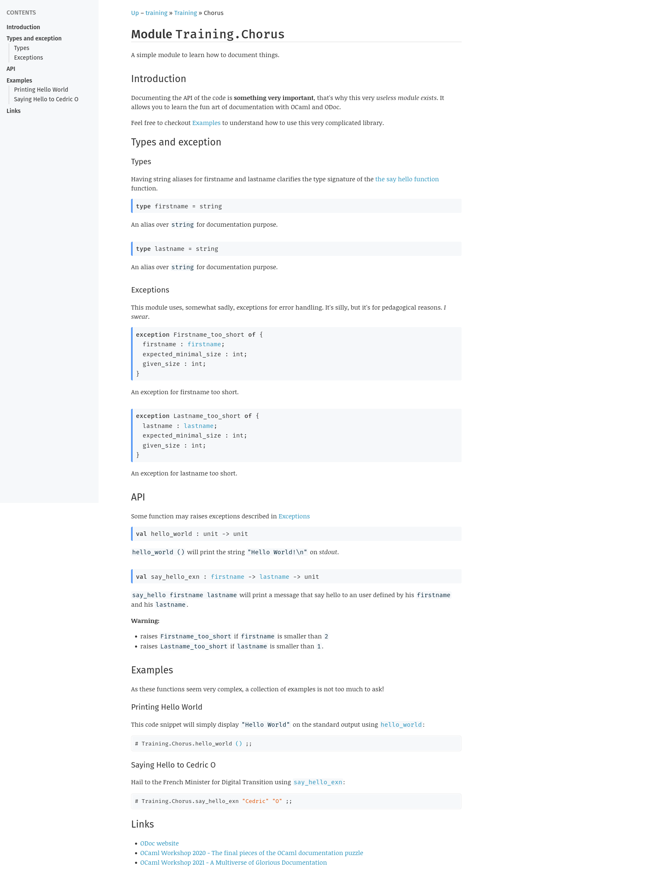

# Training ODOC

Documentation is an essential part of code sharing for several reasons:
- communicating about the use of a library
- with tests they simplify the understanding of a code base and facilitate the
  onboarding of a new developer
- In a way, writing documentation also makes it possible, as a complement, in a
  development phase, to test the user experience of a tool.
  
A documentation generator is part of the trinity implemented in languages
recognised as facilitating adherence (such as [Rust](https://www.rust-lang.org)
or [Elixir](https://elixir-lang.org/)):
- a package manager
- a build system (which facilitates the production of build or runtime units and
  ideally orchestrates the package manager.)
- a documentation generator.

Informally enough, a documentation generator (or documentation tool) forms a
small pool of tool (ideally orchestrated by the build system) that interact with
markers defined by the language syntax.

In this presentation, we will go over several points (and hidden gems) related
to the [odoc](https://github.com/ocaml/odoc) tool, documenting a very small and
unambitious project. It is an introduction to documentation construction and I
invite you to look further (especially at the documentation frameworks).

> From then on I will speak of a documentation generator but to be totally
> ideological I should speak of a documentation framework in which the generator
> is, in fact, only one of the components.

## Historically

Originally, the canonical OCaml documentation generator was the famous
[OCamldoc](https://ocaml.org/manual/ocamldoc.html) bundled with OCaml (its
source code is in the main repo). It worked quite well even if one could regret
a rather clumsy visual style (by default):


Although this is a point that can easily be improved by providing your own style
sheet, you might want a more "web 2.0" default style. And even if it is possible
to improve the colorimetry and the airiness of the content, a documentation page
lacked hierarchy and structure. The [official OCaml
documentation](https://ocaml.org/api/index.html), generated with OCamldoc, is
far more convincing than the default theme and benefits from search
functionality, and a sidebar that prioritises information, but this is the
result of a preprocessing phase that no user would want to have to worry about.)

Building a documentation generator for OCaml **is a complex exercise**, because
to date SML and OCaml seem to be the only mainstream languages with such a
powerful module system and separate compilation mechanism. Everything became
more complicated when Dune became the standard build system for OCaml because
Dune builds internal representations. For example `foo/bar.ml` will be compiled
as `Foo__bar` and Dune will generate a `Foo` module of that form:

```ocaml
module Bar = Foo__bar
```

With this kind of compilation scheme, allowing cross-references in the
documentation can be complicated. This is why ODoc has been proposed as an
alternative and to date, from my point of view, it is a robust, mature and
compelling alternative that has the luxury of interfacing well with Dune. A
funny thing is that when ODoc was announced, the tool had (at the time) no
documentation, _mueheh_. By the way, ODoc can generate HTML, LaTeX and MAN
pages. But for this tutorial we will only focus on the HTML generation (that has
a pretty decent default theme by default!).

## Project setup to be documented

We will try to give an overview of the use of ODoc by documenting a small and
very simplistic library.

> As I'm still a keel with **esy** (I'm working on improving it), the workflow I
> propose is pretty basic and _opam & make based_.

First, let's create a local switch:

```sh
opam switch create . ocaml-base-compiler.4.13.1 --deps-only -y
```

After that we can fetch the dependencies: 

```sh
make deps
make dev-deps
```

If `make` is not installed, you can simply run these commands:

```sh
opam install . --deps-only --with-doc --with-test -y
opam install dune merlin ocamlformat ocp-indent utop -y
```

When these chores are done, we can run `make` to build `src` and the
documentation. If everything has been installed correctly, your documentation
should be in `_build/default/_doc/_html/index.html`. Feel free to open the file and 
navigate to see what has been built.

(If `make` is not installed, you can run `dune build; dune build @doc` or just
install `make`.)

## How to write documentation

Even there is [some
differences](https://ocaml.github.io/odoc/ocamldoc_differences.html) between
ODoc and OCamldoc, core concepts are essentially the same because it relie on
OCaml compilation scheme (when you compile ocaml you will produce a lot of
intermediate files like `cmt` and `cmti` that are useful for code inspection
tool and that handle comments and docstring comments) so there is (by default)
two kinds of comment.

### Regulars

Regulars comments, formed like that: `(* I'm a regular comment *)` are useful
for **explaining code**, for example:

```ocaml
let finalize_receipt operation =
  match Alpha_block_services.(operation.protocol_data, operation.receipt) with
  | ( Operation_data {contents = operation_contents; _},
      Some (Operation_metadata {contents = result_contents}) ) -> (
      match kind_equal_list operation_contents result_contents with
      (* Since contents of Operation_data and Operation_metadata are 
         packed using existential, we use an equality witness for unpacking
         the type of the operation kind. *)
      | Some Eq ->
          let operation_and_result =
            pack_contents_list operation_contents result_contents in
            get_related_messages [] operation_and_result
      | None -> [])
  | (_, Some No_operation_metadata) | (_, None) -> []
```

These comments are not used by the documentation generator. Even if there is no
agreed consensus on "how and where to write comments" and some think that a code
fragment should be explicit enough not to need comments, in a language that
offers a sophisticated type system and on a code base that uses a lot of tricks,
**I think commenting can't hurt** ;) (If only to make it easier to discover the
code).

Regular comments can be useful for additional metadata, ie: `TODO/FIXME`, that
are well understanded by IDE (my Emacs setup will highlight `FIXME` and `TODO`)
and external tools (like CI). For example:

```ocaml
let compute_operation = function 
  | [] -> assert false (* FIXME: proper error handling (ref: issue) *)
  | x :: xs -> ... (* TODO: implem of the logic *)
```

### Docstrings

Docstrings are comments used for **describing documentation**, formed like that:
`(** I'm a docstring. *)`. Unlike regulars one that can be everywhere in your
code, docstrings are to be attached to zero or one element. For example, this code will
is ambiguous:

```ocaml
val a : unit
(** Am I linked to [a] or [b]? *)
val b : unit
```

IDEs can exploit regular comments via conventions, docstrings, on the other
hand, are structured and formatted via a rather clumsy markup language, but
sufficient to describe documentation. We will look at several of these as the
course progresses but here are a few related to text formatting:

| Markup | Effect | Html |
| -- | -- | -- |
| `{b text}` | text in bold | `<strong>text</strong>` |
| `{i text}` | text in italic | `<i>text</i>` |
| `{e text}` | text is emphased |  `<em>text</em>` |
| `{^ text}` | text is in superscript | `<sup>text</sup>` |
| `{_ text}` | text is in subscript | `<sub>text</sub>` | 

You can find [a complete overview of the
syntax](https://ocaml.github.io/odoc/odoc_for_authors.html) but don't be afraid,
I'll give, during the exercices, some other markup references.

### Where should I put documentation

We have seen that the docstrings should be attached to **one** expression, but
where should we put our documentation? Since **a `mli` file describes the public
API, by encapsulation, of a module**, it is pretty conventional to put
documentation **into the `mli`**. Or at least, if you do not like mli's file, 
in the signature. Here is an example of a poor logger.

**poor_logger.ml**
```ocaml
type level = 
  | Debug 
  | Info
  | Warning 
  | Error
  
let level_to_string = function 
  | Debug -> "DEBUG"
  | Info -> "INFO"
  | Warning -> "WARNING"
  | Error -> "ERROR"
  
let log level message =
  let level_str = level_to_string level in 
  Format.printf "[%s] %s" level_str message
```

**poor_logger.mli**
```ocaml

(** Describes the log-level *)
type level = 
  | Debug (** Level for debug log. *)
  | Info (** Level for info log, ie: application traces *)
  | Warning (** Level for warning log. *)
  | Error (** Level for error log. *)

(** [log level message] prints a [message] with a given [level]. *)
val log : level -> string -> unit
```

As you can see, `level_to_string` is not exposed so it is not necessary to
document-it. In the docstring, I use brackets. Brackets is a markup element for
putting text as inline code (in verbatim).

By default, ODoc will only produce documentation for libraries that have a
`public_name`. So you can handle encapsulation at the library-level, keeping
some elements internals.

### Convention

I have used an implicit convention documenting `log`:

```ocaml
(** [log level message] prints a [message] with a given [level]. *)
val log : level -> string -> unit
```

It is pretty common to document function like this : 

```ocaml
(** [my_function arg1 arg2 arg3] will perform operation using [arg1], [arg2]
    and [arg3]. *)
```

So starting with a _call example_ in verbatim mode, following by a small
description of the function using given parameters (also in verbatim) and
terminating with a point.

### A small detour about OCamlformat

Since [OCamlformat](https://github.com/ocaml-ppx/ocamlformat) is the standard
tool for formatting OCaml code, I took the habit that putting those lines in
`.ocamlformat`:

```ocaml
doc-comments = after-when-possible
doc-comments-padding = 2
doc-comments-tag-only = default
parse-docstrings = true
```

It allows you to do not think about formatting your docstring (and escaping what
should be escaped).

## Let's write documentation for our first module!

Let's look at the module `src/chorus.ml`, which is our first
_documentation-refactorable target_. Oh yeah, this is a full imperative module
that exposes two exceptions and two functions:

- `hello_world ()` that just prints `"Hello World!"` on the standard output
- `say_hello firstname lastname` that take a firstname, a lastname and prints
  `"Hello $firstname $lastname"` (whith the two capitalized) on the standard
  output.

The last function is horrible because it can throw two exceptions! Yes, the
function supposes that a firstname should have at least two characters and a
lastname should have at least on character (yes, the guy behind the digital
transition in France is called [Cedric
O](https://en.wikipedia.org/wiki/C%C3%A9dric_O) and it will be a shame if he
can't use our very useful module).

### Exercice 1: documenting `hello_world`

Our first task is to document the function `hello_world`, so create the `mli`, let's
write an useful comment using the convention. For example, explain that the
function will print `"Hello World!\n"` on `stdout` (where `stdout` is in
italic).

<details>
  <summary>Here is a potential solution</summary>
  
  ```ocaml
  val hello_world : unit -> unit
  (** [hello_world ()] will print the string ["Hello World!\n"] on {i stdout}. *)
  ```
</details>

### Metadata

It is possible to enrich the documentation by using metadata that are called
**block tag**. Currently, **block tag** are rendered in a very poor way in HTML
which is really sad... On the other hand, in an editor, they are very readable.
Here is a list of available metadata: 

| tag | description | 
| -- | -- |
| `@author author_name` | allows the author of the element to be specified |
| `@since version` | declares from which version the element has been available  |
| `@version version` | declares the version of the element itself |
| `@deprecated message` | marks the element as deprecated. `message` should describe when the element was deprecated, what to use as a replacement, and possibly the reason for the deprecation |
| `@param name description` | associate the the given `description` to the given parameter `name`|
| `@raise exn message` | indicates that the element may raise `exn`. The `message` should describe when this might occur |
| `@return message` | describes the return value |
| `@before version message` | allows differences in past behaviour to be described. This is intended to be used to document compatibility issues |
| `@see <url> message` | add a reference to the `url` with `message` as a comment |
| `@see 'filename' message` | add a reference to the given file with `message` as a comment |
| `@see "document-name" message` | add a reference to a document with `message` as a comment |
| `@canonical` | declares the path to the canonical instance of this element. Can be applied to modules, module types and types |

#### About canonical

Here is an example of using canonical:

```ocaml
(** @canonical Foo.Bar *)
module Bar = Foo__bar
```

It is in that way that Dune handle define libraries, in a common usage of ODoc,
you do not need to think about that.

#### When should I use block tag

Since block tags are poorly rendered you should: 

- write your own CSS for having a proper render
- avoid them except for `@canonical`, `@since` and `@deprecated`

A side note, `@deprecated` should be associated with `[@@ocaml.deprecated "Use
$other instead."]` (that will raise a warning at usage). For example: 

```ocaml
val lift : ('a -> 'b) -> 'a list -> 'b list
  [@@ocaml.deprecated "Use map instead."]
(** [lift f \[a1; ...; an\]] applies function f to a1, ..., an, and builds the
    list [f a1; ...; f an] with the results returned by [f]. Not tail-recursive.

    @deprecated Use map instead *)

val map : ('a -> 'b) -> 'a list -> 'b list
(** [map f \[a1; ...; an\]] applies function f to a1, ..., an, and builds the
    list [f a1; ...; f an] with the results returned by [f]. Not tail-recursive. *)
```

If you do not want to use block tag, you can just use regular markup for a
better rendering.

##### Exercice 2: try both rendering

Let's document `say_hello` using block tags and markup. First, using block tags:

```ocaml
val say_hello : string -> string -> unit
(** [say_hello firstname lastname] will print a message that say hello to an
    user defined by his [firstname] and his [lastname].

    @raise Firstname_too_short if the firstname is too short
    @raise Lastname_too_short if the lastname is too short *)
```

Next using markup:

```ocaml
val say_hello : string -> string -> unit
(** [say_hello firstname lastname] will print a message that say hello to an
    user defined by his [firstname] and his [lastname].

    {b Warning:}

    - raises {!exception:Firstname_too_short} if [firstname] is smaller than [2]
    - raises {!exception:Lastname_too_short} if [lastname] is smaller than [1]. *)
```

There are two new features in the use of markup! Defining an unordered list
using `-`. (using `+` instead of `-` will produces an ordered list) and
`{!exception:...}` which is a **reference**. ODoc will produce a link to the
exception. I will talk more expansively about references later.

As you can see, the second rendering is better than the first. So even I like
the idea of attaching metadata that can be used by external tools, currently I
suggest you to use regular markups tags.

### Meaningful naming convention

Although more and more IDEs support inline (or popup) display of documentation,
another way to document is to use strict naming conventions. For example, suffix
functions that propagate exceptions with `_exn`.

In addition, the type of `say_hello` does not help us much: `string -> string ->
unit`. Reading the type, it is hard to know what is the `firstname` and the
`lastname`. There is basically 3 way to fix that: 

- using **labels**: `val say_hello : firstname:string -> lastname:string ->
  unit`, but it do not compose well (in a functional setup)
- using **type aliases**: `val say_hello : firstname -> lastname -> unit` but
  it can confuse Merlin (and the last alias will become the standard infered
  type)
- using **dedicated types**.

Using dedicated type can be heavy, for example: 

```ocaml
module Firstname : sig 
   exception too_short of {
    firstname : string;
    expected_minimal_size : int;
    given_size : int;
  }
  type t = private string (* or abstract type *)
  val make : string -> t
end
```

It is mainly a developer's choice. The main advantage is that you can ensure
that user will really produces a `firstname` or a `lastname` and you can
localize exception (or more generally error handling) in each dedicated module.

#### Exercice 3: a more meaningful `say_hello`

For this exercices: 
- write two type aliases (`firstname` and `lastname`)
- rename `say_hello` to `say_hello_exn`

### Structuring a module

Having seen how to document a function (and, by implication, types, exceptions
etc.), let's see how to structure the documentation of a module. Naively, one
could believe that structuring a module only consists in documenting each of the
elements. This is indeed the first step. Let's complete the documentation of
`chorus.ml`.

#### Exercice 4: documenting exception and types

In the previous exercises, we documented our two functions. Documenting
exceptions and types by explaining in what context they may occur and what they
describe is also good practice. Let's go ahead and attach meaningful information
to our exceptions and types (ie: explaining that aliases are present only for
documentation purpose).

#### Giving context to a module

ODoc allows you to define a **preamble**. The preamble is a docstring that is not
attached to any element and occurs before any OCaml expression (other than a
regular comment or opening directives). Here is an example:

**my_list.mli**

> You will notice that a new Markup element is used, links which have this form:
> `{{:http://my-url.com} name of the link}`.

```ocaml
(** A list is an immutable, finite sequence of elements of the same type. 

    OCaml lists are
    {{:https://en.wikipedia.org/wiki/Linked_list#Singly_linked_list} Singly
    Linked List} and are {i First class} so they can be produced using a
    bracket and semicolon notation. For example, [\[5; 6; 7\]] produces a list
    with 3 elements, [5], [6] and [7]. And can be directly used in pattern
    matching. *)

type 'a t = ..
```

(As ODoc accepts open and comments before the preamble it is no problem to have
the code licence as a regular comment.)

A preamble implies a **synopsis** which is the **first paragraph** of the
preamble (and will be used in the module index). Here, in the example, the
synopsis is `A list is an immutable, finite sequence of elements of the same
type.`

By convention, the synopsis should very briefly describe the role of the module
and the rest of the preamble can describe the role of the module more
expansively.

#### Exercice 5: adding a preamble (and a synopsis) to `chorus.mli`

the Chorus module can have the following synopsis : 

> A simple module to learn how to document things.

and could have this preamble body:

> Documenting the API of the code is **something very important**, that's why this
> very _useless module_ exists. It allows you to learn the fun art of
> documentation with OCaml and ODoc.

After generating the documentation you can see that the list of exposed modules
(`_build/default/_doc/_html/training/Training/index.html`) has changed a little.
_Hell yeah_ the synopsis is present in the module list


And if we click on the module, we can see that the module is introduced by our
complete preamble! Great.


Our documentation is starting to look like something!

#### More structure using titles

signatures allow to describe in a partially free order (modulo open recursions)
the elements that constitute the documentation. It is therefore very relevant to
group functions and elements together.

The ODoc markup allows you to create 7 levels of titles (from `0` to `6`). For
the moment we will not use the `0` level, which is mainly used to give titles to
free pages, so we can go from `1` to `6` and their syntax is: `{x text}` where
`x` is the level. 

**Adding titles adds a sidebar to our documentation**. In general, this is how I
structure the documentation of a module:


```ocaml
(** synopsis. 

    {1 Introduction}
    
    preamble body
*)

(** {1 Types and exception}

    documentation of types and exceptions. *)
    
...
    
(** {1 API} *)
    
(** {2 Group of function 1} 

    documentation of a bunch of functions. *)

...

(** {2 Group of function 2} 

    documentation of an other bunch of functions. *)
    
(** {1 Additional sections} *)

...
```

I obviously start with the preamble (and in the preamble with the synopsis),
then I document the types and exceptions (which could be in different sections).
Then I document the API, i.e. the functions that I can (if it makes sense) group
into sub-categories. (For example, the `List` module groups search, filter,
association functions into separate categories). Then I finish with additional
content. For example, if it makes sense, a tutorial or bibliographical
references.

##### Exercice 6: structuring our chorus module

Let's structure our module by trying to achieve this feel free to change the
text to something more sensible! **The exercise of clarity is also part of the
art of documentation!**):


Wow, this is much more stylish than what we had at the beginning! We're coming
to the end of the documentation of a module. We have one last point to look at,
the internal references and examples !

### Internal references and links

The more attentive will have noticed that `say_hello_exn` in the `Types` section
is a link! One of the big advances in ODoc over OCamldoc is the way it handles
references. We saw that by doing `{!exception:Exn}` you could link to an
exception. In fact, references are a powerful tool for referencing elements of
the documentation. They have the form: `{!kind:name}`. Let's see the different
Kinds that can be referenced:

| kind | desc |
| -- | -- |
| `{!module:Module_name}` | Reference a module |
| `{!val:val_name}` |  Reference a value (defined using `let` or `val` in the `mli`|
| `{!type:type_name}` | Reference a type  | 
| `{!module-type:MODULE_TYPE_NAME}` | Reference a module type |
| `{!class-type:class_type_name}` | Reference a class type (OOP)  |
| `{!exception:Exception_name}` | Reference an exception |
| `{!extension:type_extension_name}` | Reference an extension of a sum type  |
| `{!field:record_field_name}` | Reference a field  |
| `{!instance-variable:instance_variable_name}` | Reference an instance variable (OOP)  |
| `{!section:section-name}` | Reference a title |
| `{!page:page_name}` | Reference a `mld` page (we will show it later) |

For example, you can define a title as a section using `{x:label title}` where
`x` is the title level, and label is an ID for being referenced.

#### Exercice 7: adding internal references

As shown in the example, we would like the `say_hello_exn` to be a reference.
And for ideological reasons, we would like to specify in the precise API section
`Some function may raises exceptions described in Exception`. So we need to add
a label to the Exception section and reference it.

#### More about references 

By default the linked text will be the name of the referenced element. But it is
possible to change this text in this way: `{{!k:name} text}`. For example:
`{{!val:say_hello_exn} the say hello function}`

In addition, the `kind` **is not mandatory**. For example `{!say_hello_exn}` will
correctly reference the `say_hello_exn` function. The kind is used to resolve an
ambiguity. (For example if a constructor has the same name as a module). But I
think it's good practice to always specify the `kind` because **it enforces the
resilience of the documentation**.

And by the way, you can manage cross-references between modules (and in the same
package) using the complete path of a reference. For example
`{!val:Foo.Bar.baz}` will reference the value `baz` in the module `Foo.Bar`,
even if the module `Foo` is an other file.

### Adding examples

Although the meticulous structure and documentation of a module is a first step
in building good documentation, sometimes adding examples helps to understand
how to use a library. For example, [Daniel Bünzli's libraries and
tools](https://erratique.ch/tags/OCaml) are often an example of very good
documentation, with comprehensive tutorials.

Using this syntax you can add multilines code block: 

```ocaml
(** 
    {[
       here put your code block
    ]}
*)
```

By convention, an example of invocation (like in a toplevel) starts by `#` and
ends with `;;`. A nice thing is that your IDE should highlight the code block
(and OCamlformat will format-it). And ODoc uses `highlight.js` for syntax
highlighting in the web render.

### Exercice 8: Adding examples in our chorus module

I suggest you add a section between `API` and `Links` called `Examples`,
referenced in the preamble which sets out two examples. One that explains how to
use `hello_world` and the second that explains how to use `say_hello_exn`. Feel
free to reference the functions in the examples!



And here we have a great example!

<details>
  <summary>Here is the complete example of the Chorus Module</summary>
  
  ```ocaml
  (** A simple module to learn how to document things.

      {1 Introduction}

      Documenting the API of the code is {b something very important}, that's why
      this very {i useless module exists}. It allows you to learn the fun art of
      documentation with OCaml and ODoc.

      Feel free to checkout {!section:examples} to understand how to use this very
      complicated library. *)

    (** {1 Types and exception}

        {2 Types}

        Having string aliases for firstname and lastname clarifies the type
        signature of the {{!val:say_hello_exn} the say hello function} function. *)

        type firstname = string
        (** An alias over [string] for documentation purpose. *)

        type lastname = string
        (** An alias over [string] for documentation purpose. *)

        (** {2:exception_section Exceptions}

        This module uses, somewhat sadly, exceptions for error handling. It's silly,
        but it's for pedagogical reasons. {i I swear}. *)

    exception
        Firstname_too_short of {
           firstname : firstname;
           expected_minimal_size : int;
           given_size : int;
    }
    (** An exception for firstname too short. *)

    exception
      Lastname_too_short of {
        lastname : lastname;
        expected_minimal_size : int;
        given_size : int;
    }
    (** An exception for lastname too short. *)

    (** {1 API}

        Some function may raises exceptions described in
        {!section:exception_section} *)

    val hello_world : unit -> unit
    (** [hello_world ()] will print the string ["Hello World!\n"] on {i stdout}. *)

    val say_hello_exn : firstname -> lastname -> unit
    (** [say_hello firstname lastname] will print a message that say hello to an
        user defined by his [firstname] and his [lastname].

       {b Warning:}

       - raises {!exception:Firstname_too_short} if [firstname] is smaller than [2]
       - raises {!exception:Lastname_too_short} if [lastname] is smaller than [1]. *)

    (** {1:examples Examples}

        As these functions seem very complex, a collection of examples is not too
        much to ask!

        {2 Printing Hello World}

        This code snippet will simply display ["Hello World"] on the standard output
        using {!val:hello_world}:

        {[
          # Training.Chorus.hello_world () ;;
        ]}

        {2 Saying Hello to Cedric O}

        Hail to the French Minister for Digital Transition using
        {!val:say_hello_exn}:

        {[
          # Training.Chorus.say_hello_exn "Cedric" "O" ;;
        ]} *)

(** {1 Links}

     - {{:https://ocaml.github.io/odoc/index.html} ODoc website}
     - {{:https://www.youtube.com/watch?v=wVyZ-KveN-w} OCaml Workshop 2020 - The
       final pieces of the OCaml documentation puzzle}
     - {{:https://www.youtube.com/watch?v=qUMbbKwagaU} OCaml Workshop 2021 - A
       Multiverse of Glorious Documentation} *)
  ```
</details>


## Exercice 9: a more ambitious example

In `src/my_option.ml` there is an huge module that need some documentation.

1. Write an `mli` file for the module
2. Group the different elements logically 
3. Write a preamble and a synopsis (try to be clear on the purpose of the
   module)
4. Write a proper structure using titles 
5. Write documentation for each element (and use reference, for example saying
   that `x` is an infix version of `y`)
6. Add links to the ocaml documentation of Option 
7. Add examples for almost `bind`, `map`, and `compare`
8. Add a message in the preamble that say that this module is probably more
   useful than `Chorus` (and use a reference)
9. experiments `@closed`, `@open` and `@inline` for module inclusion

Feel free to discuss about how to improve things!


## Doctest, or how to promote examples in unit tests

> Beware, it is an experimental, undocumented, feature of ODoc.

Doctests have been popularised by Python and adopted by many languages. The idea
is to make the examples in the documentation executable.

For the writing of the book "[Real World OCaml
V2](https://dev.realworldocaml.org/)", a tool,
[mdx](https://github.com/realworldocaml/mdx) was designed to execute OCaml code
blocks from a Markdown file. It turns out that ODoc allows code blocks to be
executed. The workflow is quite simple, you write code in an `mli`. For example
in our option module:

```ocaml
(** Let see how {!val:map} works:
    {[
      # Training.My_option.(some 10 >|= succ >|= succ >|= succ) ;;
    ]} *)
```

( Starting by `#` and ends by `;;` indicate that we would print the output of
the line) and running `make test` will produce an error: 

```diff
 (** {[
       # Training.My_option.(some 10 >|= succ >|= succ >|= succ) ;;
-    ]} *)
+      - : int option = Some 13
+]} *)
```

So you need to **promote** the build artifact that will update your file. So: 
- `make test` will just ensure that outputs are corrects
- `make test; dune promote` will produce an new output.

### Setup of mdx

First you need to tell Dune that you are going to use Mdx by changing the
`dune-project`:

```diff
  (lang dune 3.0)
  (name training)
+ (using mdx 0.2)
```

Then you have to specify on which file you want to run Mdx. So we will modify
`src/dune`:

```diff
  (library
   (name training)
   (public_name training))

+ (mdx
+  (libraries training)
+  (files *.mli))
```

The field `libraries` is for adding libraries in the context.

And now, running `make test` (or `dune runtest --no-buffer -j 1`), the tests
should fail because the Chorus examples had not yet been run. So let's run `make
test; dune promote`. Wow, so nice, the output is printed and files are updated.

#### Caveat

Sometimes, **you need to run twice the command**: `make test; dune promote; make
test; dune promote` because the formatting is not yet perfect. Don't panic, I'm
sure it would be fixed very quickly.

### Improving documentation

Prefixing everything with `Training` can be anoying, don't worry, you can
execute OCaml code that will not outputed (but typechecked). For example in our
Chorus example we could do that:

```ocaml
(** {1:examples Examples}

    {[open Training.Chorus]}

    As these functions seem very complex, a collection of examples is not too
    much to ask!

    {2 Printing Hello World}

    This code snippet will simply display ["Hello World"] on the standard output
    using {!val:hello_world}:

    {[
      # hello_world () ;;
      Hello World!
      - : unit = ()
    ]}

    {2 Saying Hello to Cedric O}

    Hail to the French Minister for Digital Transition using
    {!val:say_hello_exn}:

    {[
      # say_hello_exn "Cedric" "O" ;;
      Hello Cedric O
      - : unit = ()
    ]} *)
```

But the problem is that it requires displaying implementation details in the
documentation! Fortunately, Odoc has a special comment marker: `(**/**)` which
allows you not to document what is between these special comments. 

```ocaml
(** {1:examples Examples} *)

(**/**)

(** {[open Training.Chorus]} *)

(**/**)

(** As these functions seem very complex, a collection of examples is not too
    much to ask!

    {2 Printing Hello World}

    This code snippet will simply display ["Hello World"] on the standard output
    using {!val:hello_world}:

    {[
      # hello_world () ;;
      Hello World!
      - : unit = ()
    ]}

    {2 Saying Hello to Cedric O}

    Hail to the French Minister for Digital Transition using
    {!val:say_hello_exn}:

    {[
      # say_hello_exn "Cedric" "O" ;;
      Hello Cedric O
      - : unit = ()
    ]} *)
```

#### Trouble with formatting

One annoying (and probably also soon to be fixed) problem is that Mdx uses a
different formatting strategy than the one defined by the OCamlformat file. This
means that when we run arbitrary code (not top-level code), e.g. our `(** {[open
Training.Chorus ]} *)`, every time we save, OCamlformat will reformat our buffer
which will break the tests.

At present, the only solution I have found is based on a Sioux trick:

```ocaml
(**/**)

include sig
  (** {[open Training.Chorus ]} *)
end
[@@ocamlformat "disable"]

(**/**)
```

Yeah, this is **ugly**... but it works.

#### Exercice 10: write doctest for the My_option

Now that we have all the tools we need to promote our examples to unit tests,
write doctests for the "complicated" functions in the `My_option` module. **Feel
free to share your examples!**

## Hiding the internal plumbing while exposing it

It is common, in OCaml, to have correct functions by construction, but sometimes
one would like to have "hidden" (but accessible) functions **only for testing**.
For example, here is a signature:

```ocaml
type t = private
  { index : int
  ; timestamp : float
  ; hash : Sha256.t
  ; previous_hash : Sha256.t
  ; producer : Dsa.Public.t
  ; signature : Dsa.t
  ; transactions : Transaction.t list
  }

val genesis : t
val is_genesis : t -> bool

val make
  :  ?timestamp:float
  -> identity:Dsa.Secret.t
  -> transactions:Transaction.t list
  -> int * Sha256.t
  -> t

val hash : t -> Sha256.t
val verify_hash : t -> bool
val verify_signature : t -> bool
val get_previous_hash : t -> Sha256.t option
val equal : t -> t -> bool
val pp : Format.formatter -> t -> unit

module For_testing : sig
  val index : int -> t -> t
  val timestamp : float -> t -> t
  val hash : Sha256.t -> t -> t
  val previous_hash : Sha256.t -> t -> t
  val producer : Dsa.Public.t -> t -> t
  val transactions : Transaction.t list -> t -> t
end
```

The role of the `For_testing` module, as its name suggests, is **only** to
facilitate the construction of unit tests. As such, its presence in the
documentation does not make much sense. One can simply use `(**/**)` as seen
above to hide it in the documentation:

```ocaml
(**/**)
module For_testing : sig
  val index : int -> t -> t
  val timestamp : float -> t -> t
  val hash : Sha256.t -> t -> t
  val previous_hash : Sha256.t -> t -> t
  val producer : Dsa.Public.t -> t -> t
  val transactions : Transaction.t list -> t -> t
end
(**/**)
```

## Standalone documentation page

The last point I would like to mention is the possibility of creating
"standalone" pages. You can use the ODoc markup to build standalone pages (but
which benefit from cross-referencing, but for which Mdx does not yet work).

First, we need to tell Dune that our library(s) belong to the same package. To
do this, we'll add to `src/dune` this stanza:

```diff
  (library
   (name training)
   (public_name training))
  
+ (documentation
+   (package training))
+ 
  (mdx
   (libraries training)
   (files *.mli))
```

And now you can create `.mld` files in `src/` which will be projected into the
layout of your documentation. A `mld` file must starts with a title of level `0`.

### Exercice 11: create an index

If a file is called `index.mld`, it will replace the odd library entrypoint with
the page. For example, create the file `src/index.mld`:

``` ocaml
{0 I'm a freshly created index}

Hello World!

{1 API Documentation}

{{!module:Training} Access to the full API}
```

After running `make`, the index of your documentation should be replaced by your new page. 

1. Fill in your index with a text that explains what you have learned today (if
   you have learned anything)
2. Add a `feedback.mld` page in which you write in a structured way (with
   headings and all) that you will reference from the index with
   `{{!page:feedback} See feedbacks}`.


The `mld` files are incredibly useful for writing comprehensive tutorials and
indexes!

## Going further

We have seen many things. Overall, writing documentation brings several positive
points and can be very funny. The Markup language allows you to structure very
dense documentation correctly. **Don't hesitate to abuse references and
examples**!

To go further:

- Read the whole [ODoc documentation](https://ocaml.github.io/odoc/index.html)
- Read the whole [MDX documentation](https://github.com/realworldocaml/mdx)
- For the moment we've only looked at how to generate package documentation
  (which is sufficient in 90% of cases because you can expose several libraries
  in one package) but it's possible to handle cross-package dependencies with
  [odig](https://erratique.ch/software/odig/doc/index), or
  [digodoc](https://github.com/OCamlPro/digodoc) or by [writing your own
  driver](https://ocaml.github.io/odoc/driver.html), as was done for the [v3 of
  the OCaml.org website](https://v3.ocaml.org/packages) (which exposes, well,
  the package documentation)
- Write documentation, clear, structured, illustrated and full of unit tests!
- Learn how to fit with a documentation design system

### Potential side-projects

- Build a nice looking (and properly ventilated and block-tagged) `Marigold`
  theme for odoc (and odig)
- More ambitious, but create a static analysis tool of `cmt` and `cmti` to
  collect metrics on documentation. For example documentation coverage and
  potentially linking it to a CI to enforce best practices.
  
Thanks a lot for your time, feel free to ping me (privately or in
`#marigold-help`) for anything.
